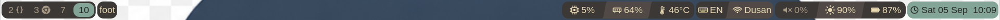

# dbar

A small, event-driven Wayland status bar for Sway/SwayFX. It renders with
`tiny-skia` on a `wlr-layer-shell` surface and reads what it shows itself, from
`/proc`, `/sys` and PipeWire. Any i3bar-compatible provider can supply the rest.



*[examples/advanced.toml](examples/advanced.toml): Gruvbox islands with curved
transitions between the modules inside each one.*

There is no polling loop and no animation tick: the bar redraws when something
it shows has changed and sleeps otherwise, and one shared timer serves every
collector that is on an interval, so adding a module adds no wake-up. On the
machine this was written on it holds about 9 MB of memory, and drawing the bar
above at 1920 wide takes around 95 microseconds.

Nothing else has to be installed. The collectors are dbar's own, so a config
that names no external provider starts no child process at all.

This is the **V0** milestone from [spec.md](spec.md).

## Quick start

```sh
git clone https://github.com/dborovcanin/dbar && cd dbar
make prod                                          # optimized build
./target/release/dbar -c examples/advanced.toml    # try one of the example bars
make install                                       # keep it: ~/.local/bin
```

### What it needs

A compositor with `wlr-layer-shell` — Sway or SwayFX — and Rust 1.88 or newer.
The build links PipeWire, and generates bindings for it with `clang`:

```sh
# Arch
sudo pacman -S --needed rust clang libpipewire

# Debian / Ubuntu
sudo apt install rustc cargo clang pkg-config libpipewire-0.3-dev
```

PipeWire and D-Bus are only *used* if a config asks for the volume or the media
module, and are ignored if it does not — but the PipeWire headers are needed to
build either way.

Once you like one, keep it as your own and let Sway start it:

```sh
mkdir -p ~/.config/dbar
cp examples/advanced.toml ~/.config/dbar/config.toml
```

```sh
# in ~/.config/sway/config, replacing the bar { ... } block
exec_always pkill -x dbar; dbar
```

`dbar` with no arguments reads `~/.config/dbar/config.toml`, and falls back to
a built-in default if there is none. `make install` takes `PREFIX=` if
`~/.local/bin` is not where you want it.

## What works

- `wlr-layer-shell` surface, top or bottom placement, configurable margin and
  exclusive zone
- per-pixel transparency, so SwayFX blur shows through
- text rendering with shaping and font fallback (`cosmic-text`)
- native collectors for cpu, memory, battery, backlight, load, temperature,
  disk, network, volume and the clock, read on one shared timer that wakes only
  when something is due
- sources that are told rather than asked, and cost no wake-ups at all: the
  backlight through `poll()` on sysfs, the battery through the kernel's uevent
  broadcast, and the volume through PipeWire
- i3bar input under `[i3bar]`: any i3bar-compatible provider, `i3status-rs` by
  default. A config that reads nothing from one starts no child process at all
- module state styling, keyed on a value, on a named field, on how the source
  rates itself, or on hover
- `format_alt`: further wordings a left click moves through and back round —
  one written as a string, several as a list
- `scroll = "5%"`: scrolling over a backlight or volume module changes it, and a
  middle click mutes; dbar sets both itself rather than running a helper
- `controls = true` on a media module: a left click plays and pauses, and the
  wheel moves between tracks, over MPRIS on the session bus
- `collapsible = true`: a right click folds a module down to its icon, and the
  next one unfolds it
- `signal = N`: read a source again on SIGRTMIN+N
- `left` / `center` / `right` positions holding groups of modules
- rounded group and module backgrounds
- click forwarding back to the provider (left, middle, right, scroll)
- integer HiDPI buffer scaling
- separators as real vector geometry: `line`, `slant`, `chevron`, `notch`,
  `round` and `curve`, each mirrorable, with Powerline colour modes and an
  overlap that hides antialiasing seams
- per-side group edges, with group contents clipped to the group outline
- `opacity` per group: the island is drawn opaque and faded once, so a
  see-through bar can still use filled separators
- a format grammar for what each module says: typed fields, number and text
  formatting, `{groups}` that disappear when a field has nothing to report, and
  `$a|$b|'fallback'` chains

Not yet implemented: Bluetooth, command modules, multi-monitor. See [dbar-native.md](dbar-native.md)
for where this is going.

## Build

```sh
make          # debug build, fast
make prod     # optimized build
make install  # installs to ~/.local/bin (override with PREFIX=)
```

## Run

```sh
dbar                    # uses ~/.config/dbar/config.toml, or built-in defaults
dbar -c path/to.toml    # explicit config
dbar --print-config     # writes the built-in default config to stdout
```

Everything the built-in default shows is read by dbar itself, so there is
nothing to install alongside it. An external provider is only started when a
module asks for one - see [the i3bar provider](#the-i3bar-provider).

```sh
mkdir -p ~/.config/dbar
dbar --print-config > ~/.config/dbar/config.toml   # start from the annotated default
```

## Configuration

[examples/config.toml](examples/config.toml) is the annotated default, and is
also what dbar compiles in and uses when no config file exists.

The rest of `examples/` is a gallery. Each one is a complete bar in a different
style, annotated with why it looks the way it does, and each runs with nothing
else installed:

| | |
|---|---|
| [daily.toml](examples/daily.toml) | an everyday bar, every module read by dbar itself |
| [separators.toml](examples/separators.toml) | all seven separator shapes, side by side |
| [powerline.toml](examples/powerline.toml) | an edge-to-edge ribbon with pointed transitions |
| [islands.toml](examples/islands.toml) | translucent rounded panels floating over the wallpaper |
| [minimal.toml](examples/minimal.toml) | text and hairlines, along the bottom of the screen |
| [states.toml](examples/states.toml) | modules that restyle themselves as values move |
| [advanced.toml](examples/advanced.toml) | Gruvbox islands, curved transitions, translucent over the wallpaper |

```sh
dbar -c examples/islands.toml
```

[examples/showcase.toml](examples/showcase.toml) is the reference: every key
dbar understands appears in it at least once. It is the one example that needs
an external provider, so point its `[i3bar] args` at a real configuration
before running it.

```sh
dbar -c examples/showcase.toml
```

```toml
[bar]
height = 34
position = "top"      # or "bottom"
margin = 6            # floats the bar off the screen edge
gap = 6               # space between groups
font = "Inter 10"

[bar.background]
color = "#00000000"   # last two hex digits are alpha
radius = 0

[colors]
surface = "#313244cc"
text = "#cdd6f4"

[right]
groups = ["system"]

[style.default]
foreground = "$text"  # "$name" refers to a [colors] entry
padding = 8

[module.cpu]
source = "cpu"        # read by dbar itself
interval = "2s"       # needs a unit
format = " $utilization.n(w:4) "

[group.system]
modules = ["cpu"]
background = "$surface"
radius = 10
padding = 4
spacing = 0
```

Style resolution runs built-in defaults, then the named `[style.*]` a module
picks, then that module's own keys.

### Icons

dbar draws its own icons as vector geometry, so they scale with `icon_size`
rather than riding on a font:

```toml
[bar]
icon_size = 15          # base for every icon

[style.compact]
icon_size = 12          # overrides the bar

[module.clock]
icon = "clock"
icon_size = 18          # overrides both
```

`icon_size` cascades like any other style property: `[bar]` sets the base, a
named style overrides it, and a module overrides that. With `[bar] icon_size`
left out it defaults to 1.4x the font size, so icons scale with the text.

`icon_gap` is the space between an icon and its text, in logical pixels. Left
out, it is a quarter of the icon size, so a bigger icon keeps its breathing room
without being told; set it to tighten a busy bar.

Fixed: `cpu`, `memory`, `disk`, `clock`, `ethernet`, `headphones`, `wifi-off`,
`volume-muted`, `play`, `pause`.

Graded: `battery`, `battery-charging`, `wifi`, `volume`, `brightness`,
`temperature`. These have five steps and pick one from the value the source
published — a battery at 58% draws a little over half full, and a thermometer
reads its degrees as a share of a hundred, which is the range a processor lives
in. A native source publishes what it measured;
for a provider module, where rendered text is all there is, the percentage is
read back out of it, and only an `NN%` pattern counts, so text such as `92GB`,
`23:59` or `3h 5m` leaves the icon at its lowest step rather than grading on a
number that means something else.

`battery-charging` grades like `battery` and cuts its bolt out of the charge
bar, so it reads at any level. Nothing selects the off states automatically
yet; `wifi-off`, `volume-muted` and `headphones` are named outright. Value-driven selection belongs with module state styling.

#### Provider glyph icons

Alternatively an external provider can emit icons as text, in which case its own
configuration decides which set. Glyph sets live in the Unicode private use area, so the font has to carry them.
Pair one with a proportional Nerd Font such as `DejaVuSansM Nerd Font Propo`, so
body text still reads like a UI font while the icons resolve from the same face:

```toml
[bar]
font = "DejaVuSansM Nerd Font Propo 10"
```

A font without those glyphs still works - dbar falls back per glyph - but on a
system with many Nerd Fonts installed the fallback can source each icon from a
different face, leaving them mismatched in weight and size.

This route leaves the provider choosing which glyph each block gets, and ties
icon size to the font size. dbar's own icons are independent of both.

### Workspaces, the focused window and the keyboard layout

These come from the compositor rather than the status provider, so their modules
say where they are from:

```toml
[module.workspaces]
source = "sway:workspaces"
style = "plain"

[module.workspaces.states.focused]
focused = true
style = "accent"

[module.workspaces.states.urgent]
urgent = true
style = "warning"

[module.title]
source = "sway:window"
style = "plain"
```

A `sway:workspaces` module expands into one rectangle per workspace, each with
its own state and its own click target - clicking switches to that workspace.
`focused` and `visible` join `urgent` as state conditions.

The keyboard layout comes from the same place, and is reported again the moment
it is switched, so it costs no interval:

```toml
[module.language]
source = "sway:language"
format = " $short "     # "US", from xkb's "English (US)"
format_alt = " $layout "

[module.language.layouts]
"English (US)" = "EN"
"Serbian" = "RS"
```

xkb names a layout for a person to read and offers no code beside it, so `$short`
takes the qualifier in brackets where there is one and cuts the name down where
there is not. `layouts` says what to call a layout instead. With two keyboards
attached, what is shown follows the one that was switched.

The binding mode comes from there too, and is on the bar only while one is held:

```toml
[module.mode]
source = "sway:mode"
format = " $mode "      # "resize", while that mode is on
```

`default` is what a keyboard does anyway, so the module draws nothing then and
the group around it goes with it — the bar grows a segment exactly when the mode
does. The mode a compositor is already in is asked for at startup, so a bar
started inside one shows it rather than waiting for the next change.

dbar speaks the compositor's IPC directly, so this costs no dependencies. It is
optional: without a compositor to talk to, these modules simply show nothing and
the rest of the bar is unaffected.

A centred group is centred between its neighbours rather than on the bar, so a
wide right-hand run pushes it aside instead of being drawn over it. Cap a module
that has no length limit of its own:

```toml
[module.title]
source = "sway:window"
max_width = 320         # logical pixels; 0, the default, is unbounded
```

What does not fit is cut at a character boundary and marked with an ellipsis.
`max_width` bounds the whole module, so padding and any icon come out of the
same budget; if nothing is left for text, a module with an icon draws that
alone.

### Module states

A module can restyle itself conditionally:

```toml
[module.battery]
style = "stone"
icon = "battery"

[module.battery.states.warning]
below = 30
style = "warning"

[module.battery.states.critical]
below = 15
style = "critical"

[module.disk.states.full]
urgent = true           # the provider's own alarm flag
style = "critical"

[module.wifi.states.hover]
hover = true            # while the pointer is over the module
style = "hovered"

[module.volume.states.muted]
contains = "MUTED"      # a substring of the module's own text
icon = "volume-muted"

[module.volume.states.port]
field = "port"          # headphones | speaker | hdmi | bluetooth | line-out
equals = "headphones"
icon = "headphones"

[module.battery.states.charging]
contains = "CHARGING"
strip = true            # drop the wording once it has been matched
icon = "battery-charging"
```

A rule matches when every condition it states holds: `below` and `above`
compare against the value the source nominated as its main one, `field` points
them - or `equals` - at a different value it publishes, `state` matches how the
source rates
what it is reporting, `contains` matches the module's own text, `urgent`
matches the flag the provider sets, `hover` matches the pointer, and `focused`
and `visible` match a workspace. A rule stating no condition never fires.

Where two rules could be true at once, the more specific one wins: a rule that
names more conditions is tried before one that names fewer, and a tighter bound
before a looser one. Rules that are equally specific are tried in name order.

`field` and `equals` say one thing about one field. A state that is a
combination of readings says several with `fields`, and beats the rules that
name either half:

```toml
[module.volume.states.headphones_muted]
fields = { muted = "yes", port = "headphones" }
icon = "headphones-muted"
```

```toml
[module.memory.states.swapping]
field = "swap_percent"  # any number the source publishes
above = 20
style = "warning"

[module.battery.states.charging]
field = "status"        # or any word it publishes
equals = "charging"
icon = "battery-charging"

[module.cpu.states.unreadable]
state = "error"         # idle, info, good, warning, critical, error
style = "critical"
```

`equals` and `contains` both match on a word, and the difference matters:
`equals` compares a field the source published, while `contains` searches the
text a format produced. Only the first is reading what was actually measured,
so it is the one a native module uses.

`contains` and `strip` are only allowed on a module fed by an external
provider, because rendered text is all that protocol carries. They are what
lets one module cover a state the provider only spells out in words — a muted
volume, a charging battery, headphones plugged in — instead of needing a second
module for each. `strip` then removes that wording from what is drawn, so the
marker does its job without being read: the icon says it. A native source
publishes values, so its rules key on those instead.

Rules are checked tightest bound first, so `below = 15` wins over `below = 30`
at 10%, whatever order they appear in the file. Urgent rules are checked before
value rules.

A state overlays the module's own style rather than replacing it, so settings
such as `icon` survive and a graded icon keeps grading while the colours change.

`hover` is paint-only: it may change `background`, `foreground` and `radius`,
and anything affecting metrics is taken from the unhovered style. A hover style
that changed padding would resize the module under the pointer, which can move
the pointer off it and oscillate.

The bar redraws when the module under the pointer changes, not on every motion
event, so it still idles at nothing while the pointer sits still or crosses one
module.

### Separators

A separator is a transition between two neighbouring modules, drawn as vector
geometry rather than as a font glyph. It is configured per group:

```toml
[group.system.separator]
shape = "chevron"     # none | line | slant | chevron | notch | round | curve
width = 12            # horizontal space the transition occupies
direction = "left"    # "right" | "left"; mirrors the shape
color = "previous"    # previous | next | foreground | background, or a color
overlap = 1           # bleed past each side, hiding antialiasing seams
```

`color = "previous"` takes the preceding module's background for the leading
region, which is what gives the classic Powerline wedge. A group without a
separator falls back to its `spacing` for the gap between modules.

Outer corners are a separate concept:

```toml
[group.system.edges]
left = "round"        # "round" | "none"
right = "round"
radius = 12           # defaults to the group's own radius
```

Group contents are clipped to the group outline, so square module corners and
separator overlap never spill past a rounded edge.

A group can also be faded as a whole:

```toml
[group.system]
opacity = 0.8         # 0.0 to 1.0, default 1.0
```

The island is drawn opaque and composited once at that alpha, so everything
inside it meets everything else at full strength. That is what a translucent bar
wants and what an alpha on a colour cannot give: a filled separator lays its
ground across the whole gap and its shape over the top, so two fills that were
each already translucent would composite where they overlap and leave the shape
heavier than the modules it runs between. Reach for `opacity` rather than an
alpha on `background`, and keep filled separators and translucent colours apart.

Fading costs a redraw a copy of the island's own rectangle, and a buffer as
large as the widest faded island - nothing at all for a bar that asks for none.

A group can also come to a point where it meets the bar, which is what turns a
run of blocks into a ribbon:

```toml
[group.system.ends]
left = "chevron"      # any separator shape, or "none"
right = "none"
width = 14            # defaults to the separator's width
overlap = 1
```

An end is the same transition as between two modules, drawn between a module
and whatever is behind the bar. The shapes face the way the group's separators
do, and the space they need is reserved beside the modules rather than taken
from them.

Instead of `"*"`, a group may list block names to select and order them
explicitly:

```toml
[group.system]
modules = ["cpu", "memory", "time"]

[module.cpu]
style = "default"
```

### Sources

A module says where its content comes from:

```toml
[module.cpu]
source = "cpu"
interval = "2s"       # how often dbar reads it; a unit is required
```

These are read by dbar itself, from `/proc`, `/sys`, PipeWire and the session
bus:

| source | fields |
|---|---|
| `cpu` | `$utilization` |
| `memory` | `$percent` `$used` `$total` `$available` `$swap_percent` `$swap_used` `$swap_total` |
| `battery` | `$percent` `$status` `$supply` `$power` `$time` `$health` `$threshold` |
| `backlight` | `$brightness` `$device` |
| `audio` | `$volume` `$muted` `$device` `$port` |
| `media` | `$title` `$artist` `$album` `$status` `$player` |
| `load` | `$one` `$five` `$fifteen` `$percent` |
| `temperature` | `$temp` `$average` `$label` `$chip` |
| `disk` | `$percent` `$used` `$total` `$available` `$free` `$path` |
| `network` | `$down` `$up` `$device` `$state` `$ssid` `$signal` `$dbm` `$received` `$sent` |
| `time` | `$now` |
| `sway:window` | `$title` |
| `sway:workspaces` | `$name` |
| `sway:language` | `$layout` `$short` `$index` |
| `sway:mode` | `$mode` |

Three of them are pointed at something, and take that from a key of their own:

```toml
[module.root]
source = "disk"
path = "/"            # default: the root filesystem

[module.net]
source = "network"
interface = "wlp3s0"  # default: whichever hardware interface is up

[module.temp]
source = "temperature"
chip = "amdgpu"       # default: the processor's own sensor
```

A `network` module left to choose follows whichever real interface is up, so
unplugging a cable moves it to the wireless card. Container and bridge
interfaces are never picked — a machine running Docker has dozens of them, and
none is what a person means by "the network". They share one timer, which wakes when the earliest is due, reads
everything that has come due and redraws once — ten modules on one interval
cost one wake-up between them. The clock lands its readings on the wall clock,
so a module showing minutes changes when the minute does.

A collector that fails keeps its last good reading on screen, says so once in
the log, and is tried less often until it recovers. `state = "error"` is how a
config styles that.

`signal` reads a source again on demand, so an interval only has to be short
enough for changes nothing else announces:

```toml
[module.backlight]
source = "backlight"
signal = 8            # counted from SIGRTMIN
```

```sh
brightnessctl set +10%; pkill -RTMIN+8 dbar
```

The offsets count from SIGRTMIN rather than being absolute numbers, because
where the realtime range starts is decided by the C library — the first few are
reserved for the threading implementation — so an absolute number is not
portable even between two Linux machines.

`sway:window`, `sway:workspaces`, `sway:language` and `sway:mode` come from the
compositor.
Everything else comes from an external i3bar-protocol provider, which is the default when a
module names no source at all.

### The i3bar provider

For what dbar cannot read yet — Bluetooth, the weather, a mail count — point
`[i3bar]` at a provider with its own configuration:

```toml
[i3bar]
command = "i3status-rs"
args = ["/path/to/its/config.toml"]
names = ["disk", "wifi", "volume", "battery"]
```

The protocol gives a provider no way to name its blocks usefully — `i3status-rs`
numbers them `"0"`, `"1"`, ... and rejects a `name` key — so `names` says what
they are, in the order the provider emits them. Groups and modules then select
on those names:

```toml
[group.desktop]
modules = ["disk", "wifi"]

[module.disk]
style = "accent"
```

The names are dbar's own; click events still carry the name the provider gave
the block, so it can route them back. Positions are only trusted once the
provider has emitted as many blocks as are named — until then the array is
short and every name after a missing block would land on the wrong one.

**No module reading from a provider means no provider.** dbar starts no child
process for a configuration that does not need one, which is the case for the
built-in default.

If a group's module list matches nothing, dbar logs a warning naming the block
names the provider is actually sending, rather than leaving a blank bar with no
explanation. Failures of the provider itself bypass the group configuration and
are always drawn, so they cannot be hidden by a module list that filters them
out.
