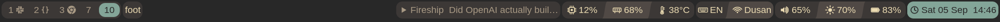
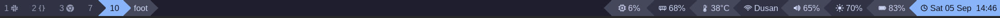
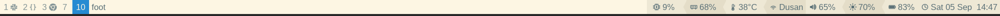
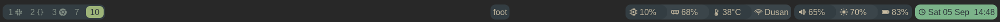

<h1>dbar </h1>

A small, event-driven Wayland status bar for Sway/SwayFX. It renders with
`tiny-skia` on a `wlr-layer-shell` surface and reads what it shows itself, from
`/proc`, `/sys` and PipeWire. Any i3bar-compatible provider can supply the rest.



*[examples/gruvbox-islands.toml](examples/gruvbox-islands.toml): Gruvbox islands with curved
transitions between the modules inside each one, and what is playing shown only
while something is.*

There is no polling loop and no animation tick: the bar redraws when something
it shows has changed and sleeps otherwise, and one shared timer serves every
collector that is on an interval, so adding a module adds no wake-up. On the
machine this was written on, the bar above holds about 20 MB resident - 5 MB of
that its own heap, the rest fonts it has mapped - and costs about a fifth of one
percent of a core to leave running. Laying a bar out takes around 4 microseconds
and painting it at 1920 wide around 110. [What that comes to against the
alternatives](#what-it-costs-to-leave-running), measured rather than asserted.

Nothing else has to be installed. The collectors are dbar's own, so a config
that names no external provider starts no child process at all.

This is the **V0** milestone from [spec.md](spec.md), and it is licensed under
[Apache 2.0](LICENSE).

## What it deliberately does not have

- **No helper processes for status.** The readings come from dbar itself, out
  of `/proc`, `/sys`, netlink, PipeWire and Sway's own IPC. There is no script
  on a timer, no `pactl` shelled out to for the volume, no `iw` for the
  wireless. A config built from native modules starts no child process at all.
- **No CSS, and no styling language.** Styles are a small cascade of named
  tables: built-in defaults, then the `[style.*]` a module names, then the
  module's own keys. There is no selector engine and nothing to invalidate.
- **No embedded interpreter.** No Lua, no JavaScript, no expression language in
  the config. Scripting belongs here as a *source* rather than a language: a
  module [runs a command and takes what it prints](#commands), on an interval or
  streaming, which is the whole extension mechanism.
- **No widget tree.** Groups hold modules and runs hold groups. That is the
  entire layout model, and it is why a redraw is measured in microseconds.

What it does support, because a bar cannot read everything yet, is the i3bar
protocol: point a module at any i3bar-compatible provider and it appears
alongside the native ones. That path is permanent, not transitional - but it is
opt-in, and a bar that does not name one never starts one.

## Quick start

Download the latest prebuilt Arch Linux binary (x86-64):

```sh
curl -LO https://github.com/dborovcanin/dbar/releases/latest/download/dbar-linux-x86_64
chmod +x dbar-linux-x86_64
sudo install -m755 dbar-linux-x86_64 /usr/local/bin/dbar
```

Or build it from source:

```sh
git clone https://github.com/dborovcanin/dbar && cd dbar
make prod                                          # optimized build
./target/release/dbar -c examples/gruvbox-islands.toml    # try one of the example bars
sudo make install                                  # keep it: /usr/bin/dbar
```

### What it needs

A compositor with `wlr-layer-shell` — Sway or SwayFX. The initial downloaded
binary targets current Arch Linux and uses its system xkbcommon, Wayland and
PipeWire libraries, which are normally already present with Sway. Building from
source additionally needs Rust 1.89 or newer and `clang` to generate the
PipeWire bindings:

```sh
# Arch
sudo pacman -S --needed rust clang libxkbcommon wayland libpipewire

# Debian / Ubuntu
sudo apt install rustc cargo clang pkg-config \
    libxkbcommon-dev libwayland-dev libpipewire-0.3-dev
```

On a machine already running Sway most of these are present; `clang` and the
`-dev` packages usually are not.

PipeWire and D-Bus are only *used* if a config asks for the volume or the media
module, and are ignored if it does not — but the PipeWire headers are needed to
build either way.

Once you like one, keep it as your own and let Sway start it:

```sh
mkdir -p ~/.config/dbar
cp examples/gruvbox-islands.toml ~/.config/dbar/config.toml
```

```sh
# in ~/.config/sway/config, replacing the bar { ... } block
exec_always pkill -x dbar; dbar
```

`dbar` with no arguments reads `~/.config/dbar/config.toml`, and falls back to
a built-in default if there is none. `sudo make install` puts the binary in
`/usr/bin`; `PREFIX=` moves it, so `make install PREFIX=$HOME/.local` needs no
root at all.

## What works

- `wlr-layer-shell` surface, top or bottom placement, configurable margin and
  exclusive zone
- per-pixel transparency, so SwayFX blur shows through
- text rendering with shaping and font fallback (`cosmic-text`)
- native collectors for cpu, memory, battery, backlight, load, temperature,
  disk, network, volume and the clock, read on one shared timer that wakes only
  when something is due
- sources that are told rather than asked, and cost no wake-ups at all: the
  backlight through `poll()` on sysfs, the battery through the kernel's uevent
  broadcast, and the volume through PipeWire
- i3bar input under `[i3bar]`: any i3bar-compatible provider, `i3status-rs` by
  default. A config that reads nothing from one starts no child process at all
- module state styling, keyed on a value, on a named field, on how the source
  rates itself, or on hover
- `format_alt`: further wordings a click moves through and back round — one
  written as a string, several as a list; `alt_button` says which button, and
  defaults to the left
- `on_click = { left = [...] }`: hand a button to a program of your own, run
  directly with no shell. A calendar over the clock, a mixer over the volume —
  the things a bar should reach rather than grow
- `scroll = "5%"`: scrolling over a backlight or volume module changes it, and a
  click mutes; `mute_button` says which and defaults to the middle. dbar sets
  both itself rather than running a helper
- `controls = true` on a media module: a left click plays and pauses, and the
  wheel moves between tracks, over MPRIS on the session bus
- `collapsible = true`: a click folds a module down to its icon, and the next one
  unfolds it; `collapse_button` says which, and defaults to the right
- `collapse_animation` on a group and `alt_animation` on a module: the change of
  width a click asks for is travelled rather than jumped. The timer exists only
  while something is moving and drops itself on the frame it arrives, so a bar
  nobody is clicking on still costs nothing
- `refresh_button = "left"`: a click reads the source again — what a reading
  fetched over the network wants instead of an interval
- `pages = true` on a command module: every line of a run is a reading of its
  own, and the wheel scrolls between them — three cities from one fetch, in one
  module, with one format
- `signal = N`: read a source again on SIGRTMIN+N
- `$now.time(f:'%R',tz:'Asia/Tokyo')`: a clock about somewhere else, checked against the
  machine's own tz database when the config is read, and two of them in one
  format is two zones side by side off one reading
- `$app_id` and `$class` beside `$title` on a window module, so a rule can give
  one program its own colour without matching a title that changes with the tab
- `show_passive = false` and `order = [...]` on a tray module: leave out the
  icons whose applications say they do not matter, and pin the ones that do to
  the front
- `left` / `center` / `right` positions holding groups of modules
- rounded group and module backgrounds
- click forwarding back to the provider (left, middle, right, scroll)
- a bar per screen, appearing and going with the monitor; `outputs = ["DP-1"]`
  names the screens it belongs on, and workspace modules show the workspaces of
  the screen they are drawn on unless `scope = "session"` says otherwise
- integer HiDPI buffer scaling
- separators as real vector geometry: `line`, `slant`, `chevron`, `notch`,
  `round` and `curve`, each mirrorable, with Powerline colour modes and an
  overlap that hides antialiasing seams
- per-side group edges, with group contents clipped to the group outline
- `opacity` per group: the island is drawn opaque and faded once, so a
  see-through bar can still use filled separators
- a format grammar for what each module says: typed fields, number and text
  formatting, `{groups}` that disappear when a field has nothing to report, and
  `$a|$b|'fallback'` chains

`dbar --check-config` reads a config, says what is wrong with it and exits, with
no compositor needed; `dbar --fields` prints what every source publishes, and
`dbar --fields cpu` just the one.

Not yet implemented: Bluetooth. See [spec.md](spec.md)
for where this is going.

## What it costs to leave running

Idle should cost nothing, and the only way to know is to measure it against
what a Sway user would otherwise run. All three bars below were up at the same
time, on the same screen, showing the same things:

| idle                  | resident  | heap       | CPU        | processes | threads |
| --------------------- | --------- | ---------- | ---------- | --------- | ------- |
| **dbar**              | **21 MB** | **4.6 MB** | **0.21 %** | **1**     | 10      |
| swaybar + i3status-rs | 62 MB     | 14.4 MB    | 0.51 %     | 2         | 9       |
| Waybar                | 76 MB     | 17.9 MB    | 0.75 %     | 1         | 25      |

CPU is a share of one core, averaged over three consecutive two-minute windows;
the spread across those windows was 0.19–0.23 % for dbar, 0.49–0.53 % for
swaybar and 0.63–0.85 % for Waybar. Resident memory is `VmRSS`, which counts the
font files and shared libraries a bar has mapped; heap is `RssAnon`, which is
what it allocated for itself. Both are worth knowing and they answer different
questions - the first is what the machine gives up to have a bar on screen, the
second is what the bar is actually holding.

Then the same three over two minutes of ordinary use - a pointer crossing the
bars, modules hovered and clicked, workspaces switched:

| in use                | resident    | heap       | CPU        |
| --------------------- | ----------- | ---------- | ---------- |
| **dbar**              | **21.5 MB** | **5.0 MB** | **0.35 %** |
| swaybar + i3status-rs | 62.5 MB     | 14.5 MB    | 0.82 %     |
| Waybar                | 81 MB       | 19.0 MB    | 1.16 %     |

And what each one is before it starts:

|                       | binary        | shared libraries |
| --------------------- | ------------- | ---------------- |
| **dbar**              | **6.9 MB**    | **5**            |
| swaybar + i3status-rs | 0.1 + 17.4 MB | 46 / 29          |
| Waybar                | 2.1 MB        | 116              |

Waybar's binary is the smallest of the three and its dependency list is the
longest, which is the same fact twice: it is a GTK application, so most of it is
libraries the binary does not carry. dbar links five - libc, libm, libgcc,
xkbcommon and PipeWire - and carries the rest.

### How this was measured

On SwayFX 0.6 (Sway 1.12), a Ryzen 7 PRO 5850U, one 2560x1440 output at scale 1,
with all three bars running simultaneously so that no run got a quieter machine
than another. CPU is `utime + stime` from `/proc/PID/stat` differenced across the
window; memory is read from `/proc/PID/status` at the end of it. Both bars that
run helpers are counted whole - swaybar plus the `i3status-rs` it starts.

dbar ran [examples/gruvbox-islands.toml](examples/gruvbox-islands.toml): fifteen modules -
workspaces, binding mode, window title, media, weather, tray, cpu, memory,
temperature, keyboard layout, network, volume, brightness, battery and the clock.

Waybar ran a configuration written to match it module for module, against
Waybar 0.15.0. swaybar ran against i3status-rs 0.36.1 with eleven blocks -
weather, music, cpu, memory, temperature, keyboard layout, net, battery,
backlight, sound and time - with swaybar itself drawing the workspaces, the
binding mode and the tray. That is fourteen things rather than fifteen: it has
no window title, so it is doing slightly *less* work than the other two, not
more.

The weather module is a script fetching from a web service in all three, on the
same interval, so none of them is being charged for somebody else's network.

The idle numbers are three windows each and tight enough to trust. The in-use
row is a single human pass rather than a synthetic one, which makes it
indicative rather than statistical: it is one person using the bars for two
minutes, and every bar got the same two minutes.

None of this makes dbar better at what a bar is for. It reads what it shows
itself, from `/proc`, `/sys`, netlink and PipeWire, and draws it with a
rasteriser and a layout model that has no widget tree in it - and those two
decisions are most of the difference in the tables above.

## Build

```sh
make               # debug build, fast
make prod          # optimized build
sudo make install  # installs /usr/bin/dbar (override with PREFIX=)
sudo make uninstall
```

Releases are made by pushing a tag. `make release` checks that `main` is clean
and matches `origin/main`, then tags the version in `Cargo.toml` as `v<version>`
and pushes it; `git push origin v0.1.0` by hand does the same thing. The tag is
what GitHub Actions reacts to: it builds `dbar-linux-x86_64` in Arch Linux,
creates the release, and attaches the binary and its SHA-256 checksum. Nothing
is built or uploaded from a maintainer's machine, and a failed run is re-run
from the Actions tab rather than re-tagged.

`make release-bundle` builds the same binary and checksum locally, under
`target/release-assets`, without tagging or publishing anything.

## Run

```sh
dbar                    # uses ~/.config/dbar/config.toml, or built-in defaults
dbar -c path/to.toml    # explicit config
dbar --print-config     # writes the built-in default config to stdout
```

Everything the built-in default shows is read by dbar itself, so there is
nothing to install alongside it. An external provider is only started when a
module asks for one - see [the i3bar provider](#the-i3bar-provider).

```sh
mkdir -p ~/.config/dbar
dbar --print-config > ~/.config/dbar/config.toml   # start from the annotated default
```

## Configuration

[examples/config.toml](examples/config.toml) is the annotated default, and is
also what dbar compiles in and uses when no config file exists.

The rest of `examples/` is a gallery. Each is a complete bar in a different
style, annotated with why it looks the way it does, and each runs with nothing
else installed. Every screenshot below is that file, unedited:

### [gruvbox-islands.toml](examples/gruvbox-islands.toml)

Gruvbox islands, a `curve` between the modules inside each one, and the
compositor's binding mode appearing between the workspaces and the window only
while a mode is held.


Two of its modules reach outside dbar, and both are optional - the bar is whole
without either, and neither has to be set up before trying it:

- **The weather** runs [`examples/weather.sh`](examples/weather.sh), which needs
  `curl`, `jq` and a free [OpenWeatherMap](https://openweathermap.org/api) key in
  `~/.config/dbar/owm.key`. Without one the module draws *unavailable* and stays
  clickable; a middle click asks again once the key is there.
- **The clock's left click** opens
  [`examples/sway_calendar.sh`](examples/sway_calendar.sh), three months in a
  floating `foot` window. Any other program is one line: `on_click = { left =
  [...] }` takes an argv and runs it directly.

Both are named by a path relative to the repository, so they work when dbar is
started from a checkout. A config kept in `~/.config/dbar` wants the absolute
path to wherever you put the script - dbar runs argv directly, with no shell
anywhere, so nothing in it is expanded.

### [nord.toml](examples/nord.toml)

Nord, with the clock in the centre run and `slant` transitions. The centre is
laid out from the middle outwards, so the two ends growing does not move it.


### [powerline.toml](examples/powerline.toml)

The classic ribbon, drawn as geometry rather than font glyphs: `chevron`
transitions, a point at each end, and blocks alternating between two greys so
colour is left free to mean something.



### [pills.toml](examples/pills.toml)

Tokyo Night, one module per group, so every reading floats on its own ground.
No separators at all - nothing has a neighbour to be separated from.


### [light.toml](examples/light.toml)

Solarized Light, edge to edge, no margin and square corners, with `notch`
transitions bitten out of the surface.



### [everforest.toml](examples/everforest.toml)

Everforest along the bottom, `round` transitions, and the window title in the
centre where the eye finds it without looking.



### Also in `examples/`

|                                             |                                                        |
| ------------------------------------------- | ------------------------------------------------------ |
| [daily.toml](examples/daily.toml)           | an everyday bar, every module read by dbar itself      |
| [islands.toml](examples/islands.toml)       | translucent rounded panels floating over the wallpaper |
| [minimal.toml](examples/minimal.toml)       | text and hairlines, along the bottom of the screen     |
| [states.toml](examples/states.toml)         | modules that restyle themselves as values move         |
| [separators.toml](examples/separators.toml) | all seven separator shapes, side by side               |
| [showcase.toml](examples/showcase.toml)     | every key dbar understands, as a reference             |
| [weather.sh](examples/weather.sh)           | a `command` module's program, a page per city          |
| [sway_calendar.sh](examples/sway_calendar.sh) | three months in a floating window, for the clock's click |

The same fifteen modules arranged six other ways - same readings, same
intervals, same clicks, a different bar:

|                                                             |                                                       |
| ----------------------------------------------------------- | ----------------------------------------------------- |
| [mocha-floating.toml](examples/mocha-floating.toml)         | Catppuccin Mocha, floating, soft pills and no fills   |
| [nord-rail.toml](examples/nord-rail.toml)                   | Nord along the bottom, one rail with thin dividers    |
| [gruvbox-ribbon.toml](examples/gruvbox-ribbon.toml)         | groups joined into two ribbons, colours blending      |
| [latte-panel.toml](examples/latte-panel.toml)               | Catppuccin Latte, opaque and light, square with notches |
| [tokyonight-capsules.toml](examples/tokyonight-capsules.toml) | Tokyo Night, a capsule per reading                    |
| [rosepine-curves.toml](examples/rosepine-curves.toml)       | Rosé Pine, asymmetric islands, left-facing curves     |

```sh
dbar -c examples/islands.toml
```

[examples/showcase.toml](examples/showcase.toml) is the reference: every key
dbar understands appears in it at least once. It is the one example that needs
an external provider, so point its `[i3bar] args` at a real configuration
before running it.

```sh
dbar -c examples/showcase.toml
```

```toml
[bar]
height = 34
position = "top"      # or "bottom"
margin = 6            # floats the bar off the screen edge
gap = 6               # space between groups
font = "Inter 10"
fallback = [          # for glyphs `font` lacks; omit and dbar chooses
  "Symbols Nerd Font",
  "Noto Color Emoji",
  "Noto Sans CJK JP",
]

[bar.background]
color = "#00000000"   # last two hex digits are alpha
radius = 0

[colors]
surface = "#313244cc"
text = "#cdd6f4"

[right]
groups = ["system"]

[style.default]
foreground = "$text"  # "$name" refers to a [colors] entry
padding = 8

[module.cpu]
source = "cpu"        # read by dbar itself
interval = "2s"       # needs a unit
format = " $utilization.n(w:4) "

[group.system]
modules = ["cpu"]
background = "$surface"
radius = 10
padding = 4
spacing = 0
```

Style resolution runs built-in defaults, then the named `[style.*]` a module
picks, then that module's own keys.

### Icons

dbar draws its own icons as vector geometry, so they scale with `icon_size`
rather than riding on a font:

```toml
[bar]
icon_size = 15          # base for every icon

[style.compact]
icon_size = 12          # overrides the bar

[module.clock]
icon = "clock"
icon_size = 18          # overrides both
```

`icon_size` cascades like any other style property: `[bar]` sets the base, a
named style overrides it, and a module overrides that. With `[bar] icon_size`
left out it defaults to 1.6x the font size, so icons scale with the text.

`icon_size` is the icon's height. Icons are square apart from the battery, which
is drawn a quarter longer than it is tall, and takes that much more room on the
bar.

`icon_gap` is the space between an icon and its text, in logical pixels. Left
out, it is a quarter of the icon size, so a bigger icon keeps its breathing room
without being told; set it to tighten a busy bar.

Fixed: `tux` (penguin), `arch` (the Arch Linux mark), `cpu`, `memory`, `disk`, `clock`,
`ethernet`, `headphones`, `wifi-off`, `volume-muted`, `play`, `pause`.

Graded: `battery`, `battery-charging`, `wifi`, `volume`, `brightness`,
`temperature`. These have five steps and pick one from the value the source
published — a battery at 58% draws a little over half full, and a thermometer
reads its degrees as a share of a hundred, which is the range a processor lives
in. A native source publishes what it measured;
for a provider module, where rendered text is all there is, the percentage is
read back out of it, and only an `NN%` pattern counts, so text such as `92GB`,
`23:59` or `3h 5m` leaves the icon at its lowest step rather than grading on a
number that means something else.

`battery-charging` grades like `battery` and cuts its bolt out of the charge
bar, so it reads at any level. Nothing selects the off states automatically
yet; `wifi-off`, `volume-muted` and `headphones` are named outright. Value-driven selection belongs with module state styling.

#### Provider glyph icons

Alternatively an external provider can emit icons as text, in which case its own
configuration decides which set. Glyph sets live in the Unicode private use area, so the font has to carry them.
Pair one with a proportional Nerd Font such as `DejaVuSansM Nerd Font Propo`, so
body text still reads like a UI font while the icons resolve from the same face:

```toml
[bar]
font = "DejaVuSansM Nerd Font Propo 10"
```

A font without those glyphs still works - dbar falls back per glyph - but on a
system with many Nerd Fonts installed the fallback can source each icon from a
different face, leaving them mismatched in weight and size.

`[bar] fallback` settles both that and its cost. Finding a glyph the bar's font
lacks means trying fonts until one has it, and every font tried is read off disk
and parsed, so on a machine with a few hundred installed one unlucky character -
a Nerd Font glyph in a workspace name is the ordinary case - can stall the bar
for tens of milliseconds and leave tens of megabytes of font files mapped for as
long as it runs. Listing the families worth trying bounds the search and pins
which face the icons come from:

```toml
[bar]
font = "Noto Sans 10"
fallback = ["Symbols Nerd Font", "Noto Color Emoji", "Noto Sans CJK JP"]
```

Left out, dbar picks a short set from what is installed - one family each for
symbols, emoji, CJK and the common scripts. Naming families replaces that choice
rather than adding to it, and one that is not installed is a startup error rather
than a row of empty boxes later.

This route leaves the provider choosing which glyph each block gets, and ties
icon size to the font size. dbar's own icons are independent of both.

### Workspaces, the focused window and the keyboard layout

These come from the compositor rather than the status provider, so their modules
say where they are from:

```toml
[module.workspaces]
source = "sway:workspaces"
style = "plain"

[module.workspaces.states.focused]
focused = true
style = "accent"

[module.workspaces.states.urgent]
urgent = true
style = "warning"

[module.title]
source = "sway:window"
style = "plain"
```

A `sway:workspaces` module expands into one rectangle per workspace, each with
its own state and its own click target - clicking switches to that workspace.
`focused` and `visible` join `urgent` as state conditions.

The keyboard layout comes from the same place, and is reported again the moment
it is switched, so it costs no interval:

```toml
[module.language]
source = "sway:language"
format = " $short "     # "US", from xkb's "English (US)"
format_alt = " $layout "

[module.language.layouts]
"English (US)" = "EN"
"Serbian" = "RS"
```

xkb names a layout for a person to read and offers no code beside it, so `$short`
takes the qualifier in brackets where there is one and cuts the name down where
there is not. `layouts` says what to call a layout instead. With two keyboards
attached, what is shown follows the one that was switched.

The binding mode comes from there too, and is on the bar only while one is held:

```toml
[module.mode]
source = "sway:mode"
format = " $mode "      # "resize", while that mode is on
```

`default` is what a keyboard does anyway, so the module draws nothing then and
the group around it goes with it — the bar grows a segment exactly when the mode
does. The mode a compositor is already in is asked for at startup, so a bar
started inside one shows it rather than waiting for the next change.

dbar speaks the compositor's IPC directly, so this costs no dependencies. It is
optional: without a compositor to talk to, these modules simply show nothing and
the rest of the bar is unaffected.

A centred group is centred between its neighbours rather than on the bar, so a
wide right-hand run pushes it aside instead of being drawn over it. Cap a module
that has no length limit of its own:

```toml
[module.title]
source = "sway:window"
max_width = 320         # logical pixels; 0, the default, is unbounded
```

What does not fit is cut at a character boundary and marked with an ellipsis.
`max_width` bounds the whole module, so padding and any icon come out of the
same budget; if nothing is left for text, a module with an icon draws that
alone.

### Module states

A module can restyle itself conditionally:

```toml
[module.battery]
style = "stone"
icon = "battery"

[module.battery.states.warning]
below = 30
style = "warning"

[module.battery.states.critical]
below = 15
style = "critical"

[module.disk.states.full]
urgent = true           # the provider's own alarm flag
style = "critical"

[module.wifi.states.hover]
hover = true            # while the pointer is over the module
style = "hovered"

[module.volume.states.muted]
contains = "MUTED"      # a substring of the module's own text
icon = "volume-muted"

[module.volume.states.port]
field = "port"          # headphones | speaker | hdmi | bluetooth | line-out
equals = "headphones"
icon = "headphones"

[module.battery.states.charging]
contains = "CHARGING"
strip = true            # drop the wording once it has been matched
icon = "battery-charging"
```

A rule matches when every condition it states holds: `below` and `above`
compare against the value the source nominated as its main one, `field` points
them - or `equals` - at a different value it publishes, `state` matches how the
source rates
what it is reporting, `contains` matches the module's own text, `urgent`
matches the flag the provider sets, `hover` matches the pointer, and `focused`
and `visible` match a workspace. A rule stating no condition never fires.

Where two rules could be true at once, the more specific one wins: a rule that
names more conditions is tried before one that names fewer, and a tighter bound
before a looser one. Rules that are equally specific are tried in name order.

`field` and `equals` say one thing about one field. A state that is a
combination of readings says several with `fields`, and beats the rules that
name either half:

```toml
[module.volume.states.headphones_muted]
fields = { muted = "yes", port = "headphones" }
icon = "headphones-muted"
```

```toml
[module.memory.states.swapping]
field = "swap_percent"  # any number the source publishes
above = 20
style = "warning"

[module.battery.states.charging]
field = "status"        # or any word it publishes
equals = "charging"
icon = "battery-charging"

[module.cpu.states.unreadable]
state = "error"         # idle, info, good, warning, critical, error
style = "critical"
```

`equals` and `contains` both match on a word, and the difference matters:
`equals` compares a field the source published, while `contains` searches the
text a format produced. Only the first is reading what was actually measured,
so it is the one a native module uses.

`contains` and `strip` are only allowed on a module fed by an external
provider, because rendered text is all that protocol carries. They are what
lets one module cover a state the provider only spells out in words — a muted
volume, a charging battery, headphones plugged in — instead of needing a second
module for each. `strip` then removes that wording from what is drawn, so the
marker does its job without being read: the icon says it. A native source
publishes values, so its rules key on those instead.

Rules are checked tightest bound first, so `below = 15` wins over `below = 30`
at 10%, whatever order they appear in the file. Urgent rules are checked before
value rules.

A state overlays the module's own style rather than replacing it, so settings
such as `icon` survive and a graded icon keeps grading while the colours change.

`hover` is paint-only: it may change `background`, `foreground` and `radius`,
and anything affecting metrics is taken from the unhovered style. A hover style
that changed padding would resize the module under the pointer, which can move
the pointer off it and oscillate.

The bar redraws when the module under the pointer changes, not on every motion
event, so it still idles at nothing while the pointer sits still or crosses one
module.

### Separators

A separator is a transition between two neighbouring modules, drawn as vector
geometry rather than as a font glyph. It is configured per group:

```toml
[group.system.separator]
shape = "chevron"     # none | line | slant | chevron | notch | round | curve
width = 12            # horizontal space the transition occupies
direction = "left"    # "right" | "left"; mirrors the shape
color = "previous"    # previous | next | foreground | background, or a color
overlap = 1           # bleed past each side, hiding antialiasing seams
```

`color = "previous"` takes the preceding module's background for the leading
region, which is what gives the classic Powerline wedge. A group without a
separator falls back to its `spacing` for the gap between modules.

A group can fold down to a single icon:

```toml
[group.system]
modules = ["cpu", "memory", "temperature"]
collapsible = true
collapse_button = "right"

[group.system.collapsed]
style = "tile"        # optional named style
icon = "cpu"
```

Groups default to collapse disabled and start expanded when enabled. Enabling it
requires an explicit `collapse_button` (`left`, `middle`, or `right`) and an icon
with positive `icon_size`. The collapsed appearance uses built-in style defaults,
then the optional named style, then inline style overrides, just like a module.
Use the reserved button anywhere inside the group, including padding, caps and
internal separators, to collapse it; use that button on the icon to expand again.

The group gets its reserved button before tray actions and provider forwarding.
Configuration rejects a child binding that claims the same button: custom commands,
individual block collapse, alternate formats, refresh and native controls must use
other buttons. Conflicting actions within an individual block are also configuration
errors. Other buttons and scrolling over expanded blocks keep their usual behavior.
The collapsed icon only toggles its group; it forwards no child actions. Separators
between groups remain noninteractive.

Child collapse, alternate-format and paging states survive a group toggle. Group
state is shared across outputs and resets on restart. Sources continue updating
while hidden, so expansion shows current data. A collapsed group stays visible
even if its children become empty, provided the icon fits the available width;
an expanded empty group disappears as usual. Group background, opacity, padding,
edges and caps remain in effect, and neighboring joins use the icon's style.
[gruvbox-islands.toml](examples/gruvbox-islands.toml) uses right click to fold CPU, RAM and
temperature into a Tux penguin. `collapse_animation` gives the fold a span to
travel over rather than a jump — see [Animation](#animation).

Groups in one alignment can also share transitions, without merging their module
lists. This is opt-in independently for `left`, `center`, and `right`:

```toml
[right]
groups = ["world", "system", "connections", "power"]

[right.separator]
shape = "slant"
width = 6
direction = "right"
color = "previous"
overlap = 0
```

The separator replaces `bar.gap` between visible groups in that alignment, plus
their facing end caps and rounded group corners. Internal separators and outer
caps/corners keep their own settings. Empty groups contribute no gap; their
remaining neighbors join directly. The space between alignments still uses
`bar.gap`. Omitting the table, or setting `shape = "none"`, preserves independent
groups and their original gaps, opacity and padding.

Joined groups currently require `opacity = 1` and `padding = 0`; configuration
validation reports incompatible groups. Use opaque block fills for continuous
filled transitions, just as for separators inside a group. The join reads the
last visible block on the left and the first on the right, including their state
and hover colors. `color = "background"` refers to the bar background here, and
`line` leaves that background visible around the stroke. Width must be finite
and positive. Joins do not receive clicks. See
[gruvbox-ribbon.toml](examples/gruvbox-ribbon.toml) for a complete example. Groups remain
independently drawn: transparent group backgrounds and square block fills are
the cheapest ribbon style; separate filled, rounded group backgrounds add paint
work compared with a merged group.

Outer corners are a separate concept:

```toml
[group.system.edges]
left = "round"        # "round" | "none"
right = "round"
radius = 12           # defaults to the group's own radius
```

Group contents are clipped to the group outline, so square module corners and
separator overlap never spill past a rounded edge.

A group can also be faded as a whole:

```toml
[group.system]
opacity = 0.8         # 0.0 to 1.0, default 1.0
```

The island is drawn opaque and composited once at that alpha, so everything
inside it meets everything else at full strength. That is what a translucent bar
wants and what an alpha on a colour cannot give: a filled separator lays its
ground across the whole gap and its shape over the top, so two fills that were
each already translucent would composite where they overlap and leave the shape
heavier than the modules it runs between. Reach for `opacity` rather than an
alpha on `background`, and keep filled separators and translucent colours apart.

Fading costs a redraw a copy of the island's own rectangle, and a buffer as
large as the widest faded island - nothing at all for a bar that asks for none.

A group can also come to a point where it meets the bar, which is what turns a
run of blocks into a ribbon:

```toml
[group.system.ends]
left = "chevron"      # any separator shape, or "none"
right = "none"
width = 14            # defaults to the separator's width
overlap = 1
```

An end is the same transition as between two modules, drawn between a module
and whatever is behind the bar. The shapes inherit the group's separator
direction; set `direction = "left"` or `"right"` in the `ends` table to orient
caps independently of internal transitions. The space they need is reserved
beside the modules rather than taken from them. Use `left = "slant"` for an
angled leading cap and `right = "none"` to finish flush with the screen edge.
Slanted caps fill the side adjacent to their module: `direction = "right"`
gives a `/` diagonal and `"left"` gives a `\` diagonal.

Instead of `"*"`, a group may list block names to select and order them
explicitly:

```toml
[group.system]
modules = ["cpu", "memory", "time"]

[module.cpu]
style = "default"
```

### Animation

Two clicks change how wide something is: folding a group down to its icon, and
moving a module on to its next wording. Both jump by default, in one redraw, and
both can travel instead:

```toml
[group.system]
collapsible = true
collapse_button = "right"
collapse_animation = "250ms"   # the island between its two widths

[module.network]
format = "$ssid|$device"
format_alt = ["$down{  $up}", "$signal.n(d:0){  $dbm.n(d:0) dBm}"]
alt_animation = "120ms"        # the module between two of its wordings
```

Both take a duration with a unit — `"150ms"`, `"1s"` — and both are refused when
there is nothing to travel: `collapse_animation` without `collapsible`, or
`alt_animation` without `format_alt`, is a startup error rather than a key that
is spelled correctly and does nothing. Neither may be longer than ten seconds.

While something is travelling the bar redraws at about the rate the screen
refreshes, eased so it leaves and arrives slowly. Everything else about the click
is settled the moment it lands, so a group caught half shut still knows it is
shut, and a wording clicked again half way is already showing the new one.

The two share a single 16 ms timer that exists only while something is actually
moving and drops itself on the frame the last one arrives. Nothing is
interpolated at rest, and a bar nobody is clicking on wakes for none of it — the
same bargain the spinner makes, which draws nothing until a command has been out
for 400 ms.

What travels is the edge, not the writing. A folding island holds the contents it
was measured with and sweeps its own end over them, and a module changing wording
is laid out in the wording it is going to and cut off at its own edge. Both charge
their run the wider of the two widths for the whole travel, so a window title
further along is measured once rather than shedding and regaining a character on
every frame.

[gruvbox-islands.toml](examples/gruvbox-islands.toml) uses both: the system island folds
into Tux over 250 ms, and RAM and the network travel between their wordings.

### Sources

A module says where its content comes from:

```toml
[module.cpu]
source = "cpu"
interval = "2s"       # how often dbar reads it; a unit is required
```

On a `command` module the same key says how the program is run instead — see
[commands](#commands).

These are read by dbar itself, from `/proc`, `/sys`, PipeWire and the session
bus:

| source            | fields                                                                              |
| ----------------- | ----------------------------------------------------------------------------------- |
| `cpu`             | `$utilization`                                                                      |
| `memory`          | `$percent` `$used` `$total` `$available` `$swap_percent` `$swap_used` `$swap_total` |
| `battery`         | `$percent` `$status` `$supply` `$power` `$time` `$health` `$threshold`              |
| `backlight`       | `$brightness` `$device`                                                             |
| `audio`           | `$volume` `$muted` `$device` `$port`                                                |
| `media`           | `$title` `$artist` `$album` `$status` `$player`                                     |
| `load`            | `$one` `$five` `$fifteen` `$percent`                                                |
| `temperature`     | `$temp` `$average` `$label` `$chip`                                                 |
| `disk`            | `$percent` `$used` `$total` `$available` `$free` `$path`                            |
| `network`         | `$down` `$up` `$device` `$state` `$ssid` `$signal` `$dbm` `$received` `$sent`       |
| `time`            | `$now`                                                                              |
| `command`         | `$text`, or whatever the module declares                                            |
| `sway:window`     | `$title`                                                                            |
| `sway:workspaces` | `$name`                                                                             |
| `sway:language`   | `$layout` `$short` `$index`                                                         |
| `sway:mode`       | `$mode`                                                                             |

Three of them are pointed at something, and take that from a key of their own:

```toml
[module.root]
source = "disk"
path = "/"            # default: the root filesystem

[module.net]
source = "network"
interface = "wlp3s0"  # default: whichever hardware interface is up

[module.temp]
source = "temperature"
chip = "amdgpu"       # default: the processor's own sensor
```

A `network` module left to choose follows whichever real interface is up, so
unplugging a cable moves it to the wireless card. Container and bridge
interfaces are never picked — a machine running Docker has dozens of them, and
none is what a person means by "the network". They share one timer, which wakes when the earliest is due, reads
everything that has come due and redraws once — ten modules on one interval
cost one wake-up between them. The clock lands its readings on the wall clock,
so a module showing minutes changes when the minute does.

A collector that fails keeps its last good reading on screen, says so once in
the log, and is tried less often until it recovers. `state = "error"` is how a
config styles that.

`signal` reads a source again on demand, so an interval only has to be short
enough for changes nothing else announces:

```toml
[module.backlight]
source = "backlight"
signal = 8            # counted from SIGRTMIN
```

```sh
brightnessctl set +10%; pkill -RTMIN+8 dbar
```

`refresh_button` is the same job from the bar itself: a button given to reading
the source again, for what is worth asking for rather than sampling.

```toml
[module.weather]
source = "command"
command = ["my-weather"]
interval = "once"     # fetched at startup, and then only when asked
refresh_button = "left"
```

Both are refused where they could not mean anything: on a module fed by a
provider, on a source that arrives when it changes rather than being read, and on
a streaming command, which speaks when it has something to say and has no run to
bring forward.

The offsets count from SIGRTMIN rather than being absolute numbers, because
where the realtime range starts is decided by the C library — the first few are
reserved for the threading implementation — so an absolute number is not
portable even between two Linux machines.

`sway:window`, `sway:workspaces`, `sway:language` and `sway:mode` come from the
compositor.
Everything else comes from an external i3bar-protocol provider, which is the default when a
module names no source at all.

### Commands

For anything dbar has no collector for, a module can run a program of your own
and take what it prints. This is the whole extension mechanism, and it is
deliberately a *source* rather than a language: there is no interpreter in dbar
and nothing to learn beyond printing a line.

```toml
[module.updates]
source = "command"
# argv, executed directly. dbar never inserts a shell - ask for one if you
# want one: ["sh", "-c", "..."]
command = ["my-update-watcher"]
format = "$text"
```

`interval` says how the program is run, and there are three answers.

| `interval` | what happens                                                                |
| ---------- | --------------------------------------------------------------------------- |
| *omitted*  | **streams**: started once and read a line at a time, for as long as it runs |
| `"30s"`    | **runs to completion** every 30s, and what it printed is the reading        |
| `"once"`   | runs at startup, and after that only when something asks                    |

Streaming is the default because it is the cheapest thing there is: a line
printed is a redraw, silence costs nothing at all, and no process is started to
find out that nothing changed — the same deal the volume and media modules get.
Spawning a process takes about 0.3 ms where a whole redraw takes under a
millisecond, so a command re-run every second is a real cost, and one re-run
every minute is not worth thinking about.

An interval is what almost every script anybody already has is shaped like,
though, so reach for it and use streaming when the thing being watched can tell
you rather than being asked. Either way the program runs on its own thread and
readings arrive on a channel, so a script that takes a second to answer delays
nothing but itself.

```toml
[module.kernel]
source = "command"
command = ["uname", "-r"]
interval = "once"
format = "$text"
icon = "cpu"           # any module key works here; state rules can swap it
```

When a command is run to completion, its answer is **the last line with
anything on it**, so a script that logs before it reports still works — and
anything it wants kept out of the reading goes to standard error, which lands
in dbar's log. A non-zero exit is an error the module shows and, on an
interval, retries when the interval next comes round.

`params` are the knobs, handed to the command as further arguments in the order
they were written — `$1`, `$2`, `$3` to a shell script. They are separate from
`command` because that is what the program *is*, while these are what it is being
asked about, and what each one means is the script's business: dbar passes them
on and holds no opinion, which is what keeps one script good for two cities.

```toml
[module.weather]
source = "command"
command = ["/usr/local/bin/weather"]
params = [
  "metric",                         # $1  units
  "/home/you/.config/dbar/owm.key", # $2  a key, or a file holding one
  "45.2517,19.8369",                # $3+ where, one or more
  "44.8147,20.4143",
]
interval = "once"        # fetched at startup
pages = true             # a reading per line, scrolled with the wheel
refresh_button = "left"  # fetch again
alt_button = "right"     # swap the wording
```

Two modules running the same program with different params want two of it, and
get two: what is run is what tells one command from another.

A command that answers slowly says so. Once a run has been out for four tenths of
a second, the module shows a spinner where its icon goes until the reading lands,
and a module that has never answered appears with the spinner alone rather than
waiting to exist. Nothing is drawn before that, so a script that answers straight
away never animates and costs no wake-ups: this is the only thing on the bar that
moves without being clicked on - see [Animation](#animation) for the two that a
click sets going - and it moves only while your program is actually running.

They are arguments and nothing more, so a command that is `["sh", "-c", "..."]`
gets them the way `sh` hands out arguments after a script: the first lands in
`$0`, not `$1`. A script in a file of its own reads them as `$1`, `$2`, `$3`.

`pages = true` says every line of a run is a reading of its own, in the order
they were printed, instead of the last line being the answer. The wheel moves
between them, and the module's `format` and `format_alt` are about whichever page
is showing — so one command asked about three places is one module, one fetch and
one wording, rather than three of each.

```
icon=☁	weather=Clouds	location=Novi Sad	temp=21
icon=☀	weather=Clear	location=Beograd	temp=23
icon=🌧	weather=Rain	location=Sokolac	temp=17
```

It is opt-in because the alternative would turn a script that logs its progress
into a module with three pages of it. A script that pages should print a line per
place even when one of them failed — `state=error` and what it knows — since a
place that drops out shifts every page after it along. `examples/weather.sh` is a
working one: OpenWeatherMap, `curl` and `jq`, a page per pair of coordinates.

A line with no `=` in it is the whole of what the command said, and lands in
`$text`. To publish real values instead, say what they are:

```toml
[module.builds]
source = "command"
command = ["watch-builds"]
fields = { pending = "number", branch = "text", disk = "percent" }
format = "{$branch }{$pending queued}"

[module.builds.states.busy]
above = 5              # compares against `pending`, the first number published
style = "warning"
```

and print tab-separated pairs:

```
branch=main	pending=3
branch=main	pending=0	disk=87%
```

A value parses as the kind its module declared, a percentage may carry its `%`,
and an empty value means the field has nothing to report right now - so
`{groups}` around it collapse. Fields are declared because dbar cannot know what
somebody else's program prints, and declaring them is what lets a format naming
`$pendign` be a startup error rather than a blank space.

One key is read rather than drawn: `state=good|warning|critical|error` is how
the command rates what it is reporting, and it is what `state = "warning"` rules
match on.

If the command exits, dbar reports an error and starts it again, waiting a
second and then doubling up to a minute, so a typo in the name costs nothing.
Commands are killed when the bar is, so a restart does not leave them behind.

### The i3bar provider

For what dbar cannot read yet and no script of yours covers — Bluetooth, a mail
count, a VPN — point `[i3bar]` at a provider with its own configuration:

```toml
[i3bar]
command = "i3status-rs"
args = ["/path/to/its/config.toml"]
names = ["disk", "wifi", "volume", "battery"]
```

The protocol gives a provider no way to name its blocks usefully — `i3status-rs`
numbers them `"0"`, `"1"`, ... and rejects a `name` key — so `names` says what
they are, in the order the provider emits them. Groups and modules then select
on those names:

```toml
[group.desktop]
modules = ["disk", "wifi"]

[module.disk]
style = "accent"
```

The names are dbar's own; click events still carry the name the provider gave
the block, so it can route them back. Positions are only trusted once the
provider has emitted as many blocks as are named — until then the array is
short and every name after a missing block would land on the wrong one.

**No module reading from a provider means no provider.** dbar starts no child
process for a configuration that does not need one, which is the case for the
built-in default.

If a group's module list matches nothing, dbar logs a warning naming the block
names the provider is actually sending, rather than leaving a blank bar with no
explanation. Failures of the provider itself bypass the group configuration and
are always drawn, so they cannot be hidden by a module list that filters them
out.
